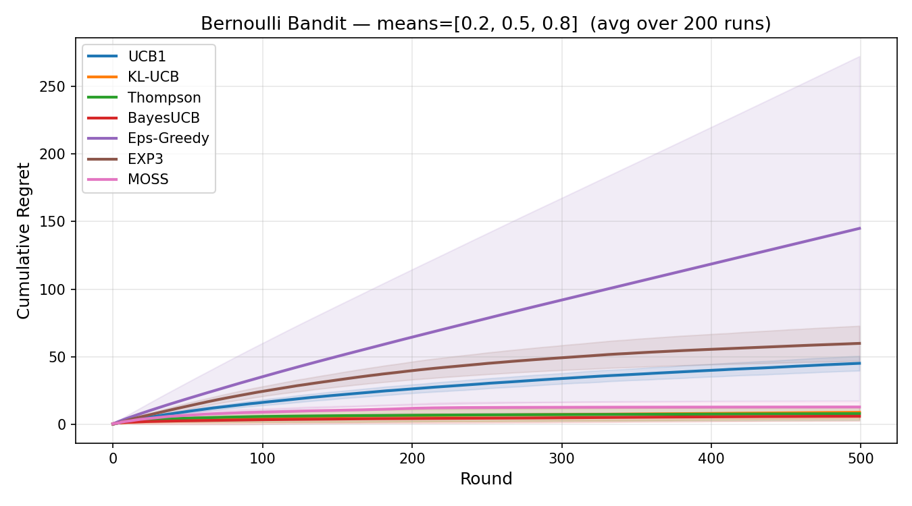

# bandits-lib

A modular, research-grade Python library for bandit algorithms, environments, and benchmark problems.

## Benchmark

Cumulative regret over 500 rounds on a Bernoulli bandit (`means=[0.2, 0.5, 0.8]`, averaged over 200 runs):



| Algorithm | Regret (T=5000) | Setting |
|---|---|---|
| BayesUCB | **15.5** | Stochastic (Bayesian) |
| Thompson Sampling | 17.7 | Stochastic (Bayesian) |
| KL-UCB | 23.9 | Stochastic (Bernoulli-optimal) |
| MOSS | 38.2 | Stochastic (minimax) |
| UCB1 | 218.8 | Stochastic |
| EXP3 | 323.9 | Adversarial |
| Epsilon-Greedy | 752.8 | General |

## Installation

```bash
pip install bandits-lib
```

Or from source:

```bash
git clone https://github.com/raja-sunkara/bandits-lib.git
cd bandits-lib
pip install -e ".[dev]"
```

## Quick Start

```python
from bandits.environments import BernoulliBandit
from bandits.algorithms import ThompsonSampling

env = BernoulliBandit(means=[0.2, 0.5, 0.8])
agent = ThompsonSampling(n_arms=3)

for t in range(500):
    arm = agent.select()
    reward = env.pull(arm)
    agent.update(arm, reward)
```

## Algorithms

| Algorithm | Class | Paper |
|---|---|---|
| UCB1 | `UCB` | Auer et al., 2002 |
| KL-UCB | `KLUCB` | Garivier & Cappé, 2011 |
| Thompson Sampling | `ThompsonSampling` | Thompson, 1933 |
| Bayes-UCB | `BayesUCB` | Kaufmann et al., 2012 |
| MOSS | `MOSS` | Audibert & Bubeck, 2009 |
| EXP3 | `EXP3` | Auer et al., 2002 |
| Epsilon-Greedy | `EpsilonGreedy` | — |

## Environments

| Environment | Class | Reward |
|---|---|---|
| Bernoulli Bandit | `BernoulliBandit` | Bernoulli(p) |

## Structure

```
bandits/
├── algorithms/     # UCB, KL-UCB, Thompson Sampling, BayesUCB, MOSS, EXP3, Epsilon-Greedy
├── environments/   # BernoulliBandit, ...
└── problems/       # best arm identification, pure exploration, ...
examples/
├── ucb_bernoulli.py          # single algorithm run
├── benchmark_bernoulli.py    # regret table across all algorithms
└── compare_regret.py         # regret curve plot
```

## Contributing

PRs welcome — new algorithms, environments, and benchmark problems are especially appreciated.

## License

MIT — free for personal and academic use.  
For commercial use, see [LICENSE](LICENSE).

## Support

If this library is useful to your research or product, consider [sponsoring](https://github.com/sponsors/raja-sunkara).
